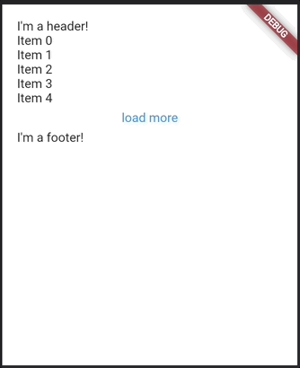

# Endless

A scroll view library with out of the box widgets for infinite loading using [pagination](#pagination), [streams](#streams) and [Firestore streams](https://pub.dev/packages/endless_firestore). Built on top of [CustomScrollView](https://api.flutter.dev/flutter/widgets/CustomScrollView-class.html).



# Features

1. **Data loading**: Many scrollable lists should be populated with an initial set of items and then load more data as a user scrolls down the list. The main job of the library is to abstract that logic into an easy to use API for building infinite scroll views that dynamically load more data.
2. **Common scrollable elements**: Many scroll view widgets have a common set of UI elements that are baked into the library including builders for *headers*, *footers*, *loading indicators*, and *empty states*.
3. **Multiple data sources**: Support for multiple types of data sources out of the box like paginated APIs and streams in order to minimize the amount of data massaging clients have to do when working with scroll views.
4. **Lists + Grids**: For Flutter mobile apps, the majority of the time scrollable views use lists, while on desktop, the added screen real estate is ideal for displaying items in grids. The library comes with both list and grid views with shared APIs.

# Pagination

The most common data source for infinite lists is generally some sort of paginated API. The library comes with two pagination widgets `EndlessPaginationListView` and `EndlessPaginationGridView` for working with this type of data. Let's take a look at some basic examples: 
## Basic List Example

```dart
import 'package:flutter/material.dart';
import 'package:endless/endless.dart';

class MyApp extends StatelessWidget {
  @override
  Widget build(BuildContext context) {
    return MaterialApp(
      home: Scaffold(
        appBar: AppBar(title: Text('Endless pagination list view')),
        body: EndlessPaginationListView<String>(
          // An async function that returns a list of items to be added to the scroll view. When you scroll past the configurable
          // `extentAfterFactor`, it calls `loadMore` to get more items.
          loadMore: (pageIndex) async => {...},
          // The pagination configuration for the scroll view determines when to stop fetching items.
          // The scroll view will stop fetching more data for either of these reasons:
          // 1. The number of items returned from loadMore is smaller than the given `pageSize`.
          // 2. It has fetched the optional `maxPages` max number of specified pages.
          paginationDelegate: EndlessPaginationDelegate(
            pageSize: 5,
            maxPages: 10,
          ),
          itemBuilder: (
            context, {
            required item,
            required index,
            required totalItems,
          }) {
            return Text(item);
          },
        ),
      ),
    );
  }
}
```

## Basic Grid Example

```dart
import 'package:flutter/material.dart';
import 'package:endless/endless.dart';

class MyApp extends StatelessWidget {
  @override
  Widget build(BuildContext context) {
    return MaterialApp(
      home: Scaffold(
        appBar: AppBar(title: Text('Endless pagination grid view')),
        body: EndlessPaginationGridView<String>(
          loadMore: (pageIndex) async => {...},
          paginationDelegate: EndlessPaginationDelegate(
            pageSize: 5,
            maxPages: 10,
          ),
          // The only difference between the basic list and grid view is that a grid specifies its delegate such as how many items
          // to put in the cross axis.
          gridDelegate: const SliverGridDelegateWithFixedCrossAxisCount(
            crossAxisCount: 3,
          ),
          itemBuilder: (
            context, {
            required item,
            required index,
            required totalItems,
          }) {
            return Text(item);
          },
        ),
      ),
    );
  }
}
```

## Advanced Example

`Endless` scroll views support a set of optional builder functions to build complex infinite scrolling lists with the following top-to-bottom UI:

```text
Header -> headerBuilder
Items -> itemBuilder
Empty state -> emptyBuilder
Loading spinner -> loadingBuilder
Load more widget (such as a TextButton) -> loadMoreBuilder
Footer -> footerBuilder
```

```dart
import 'package:flutter/material.dart';
import 'package:endless/endless.dart';

class MyApp extends StatelessWidget {
  @override
  Widget build(BuildContext context) {
    return MaterialApp(
      home: Scaffold(
        appBar: AppBar(title: Text('Endless grid view')),
        body: EndlessPaginationListView<String>(
          loadMore: (pageIndex) async => {...},
          paginationDelegate: EndlessPaginationDelegate(
            pageSize: 5,
            maxPages: 10,
          ),
          headerBuilder: () => Container(
            color: Colors.blue,
            child: const Text('Header'),
          ),
          itemBuilder: (
            context, {
            required item,
            required index,
            required totalItems,
          }) {
            return Text(item);
          },
        ),
      ),
    );
  }
}
```

In this example, we've added a header to our list. Now what if we only wanted to show our header once we've loaded items? `Endless` scroll views use the `StateProperty` pattern found in
Flutter Material's core widgets such as [Material State Property](https://api.flutter.dev/flutter/material/MaterialStateProperty-class.html).

The Material UI uses this pattern to let consumers of core widgets like `ElevatedButton` style it differently when it is in one more states (hover, pressed, etc). The basic example from the docs looks like this:

```dart
ElevatedButton(
  style: ButtonStyle(
    // Use the color green as the background color for all button states.
    backgroundColor: MaterialStateProperty.all<Color>(Colors.green),
  ),
);

ElevatedButton(
  style: ButtonStyle(
    backgroundColor: MaterialStateProperty.resolveWith<Color>(
      // The state property passes all the current states the button is in
      // so that the button style can be customized.
      (Set<MaterialState> states) {
        // Lighten the button color when it is in the pressed state. 
        if (states.contains(MaterialState.pressed))
          return Theme.of(context).colorScheme.primary.withOpacity(0.5);
        return null;
      },
    ),
  ),
);
```

We use this same pattern to support customization by the state of the scroll view. The possible states are:

```dart
enum EndlessState { empty, loading, done }
```

We can then check the current states of the scroll view to customize our header:

```dart
import 'package:flutter/material.dart';
import 'package:endless/endless.dart';

class MyApp extends StatelessWidget {
  @override
  Widget build(BuildContext context) {
    return MaterialApp(
      home: Scaffold(
        appBar: AppBar(title: Text('Endless pagination list view')),
        body: EndlessPaginationListView<String>(
          loadMore: (pageIndex) async => {...},
          paginationDelegate: EndlessPaginationDelegate(
            pageSize: 5,
            maxPages: 10,
          ),
          // Each builder has a corresponding state property builder for state-dependent UI.
          headerBuilderState: EndlessStateProperty.resolveWith((states) {
            if (states.contains(EndlessState.empty)) {
              return null;
            }

            return Container(
              color: Colors.blue,
              child: const Text('Header'),
            );
          }),
          itemBuilder: (
            context, {
            required item,
            required index,
            required totalItems,
          }) {
            return Text(item);
          },
        ),
      ),
    );
  }
}
```

The full list of endless state property helpers are given below:

* `EndlessStateProperty.all`
* `EndlessStateProperty.loading`
* `EndlessStateProperty.empty`
* `EndlessStateProperty.done`
* `EndlessStateProperty.never`
* `EndlessStateProperty.resolveWith`


Some builder functions have default state property behaviors. The `emptyBuilder` parameter for example is automatically wrapped in an `emptyStateBuilder` defined to only be built if the scroll view is empty and not loading as shown below:

```dart
EndlessStateProperty<Widget?> resolveEmptyBuilderToStateProperty(
  Builder<Widget>? builder,
) {
  return _resolveBuilderToStateProperty<Widget>(
    builder,
    (Builder<Widget> builder) =>
        EndlessStateProperty.resolveWith<Widget>((context, states) {
      if (states.contains(EndlessState.empty) &&
          !states.contains(EndlessState.loading)) {
        return builder(context);
      }
      return null;
    }),
  );
}
```

The goal of these defaults like for the `empty` state is to provide typical behavior for an endless scroll view. If that's not the default you would like for your empty state, no problem! You can always provide your own `emptyBuilderState` to override it.

# Streams

## Basic Example

```dart
import 'package:flutter/material.dart';
import 'package:endless/endless.dart';

final streamController = StreamController<List<String>>();

class MyApp extends StatelessWidget {
  @override
  Widget build(BuildContext context) {
    return MaterialApp(
      home: Scaffold(
        appBar: AppBar(title: Text('Endless stream list view')),
        body: EndlessStreamListView<String>(
          // A function called when you scroll past the configurable `extentAfterFactor` to tell the stream to add more items.
          loadMore: () => {...},
          // Items emitted on the stream are added to the scroll view. The scroll view knows to not try and fetch any more items
          // once the stream has completed.
          stream: streamController.stream,
          itemBuilder: (
            context, {
            required item,
            required index,
            required totalItems,
          }) {
            return Text(item);
          },
        ),
      ),
    );
  }
}
```

All other APIs for streams are the same as in the first examples with pagination, so check out a grid view and advanced example under the [pagination](#pagination) section.

# 3rd Party Extensions

## Firestore

The Endless Firestore extension is available as a [separate package](https://pub.dev/packages/endless_firestore).

## Working Example

Run the [example](https://github.com/danReynolds/endless/tree/master/example/example) to give it a try and play around with the config options.

## Feedback & Extensions

It's pretty straightforward to add support for other scroll view loading patterns (in addition pagination and streaming) or 3rd party extensions `endless_firestore` so make an issue if you have a new use case you're interested in seeing added.

Happy coding!
